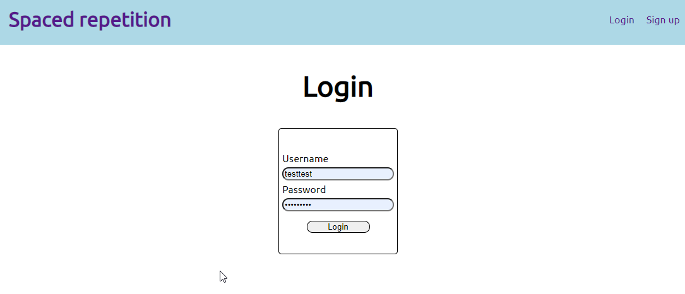
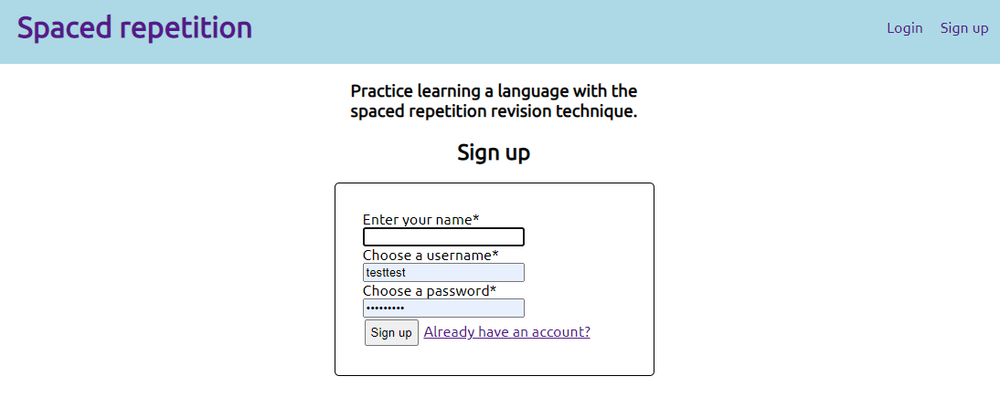
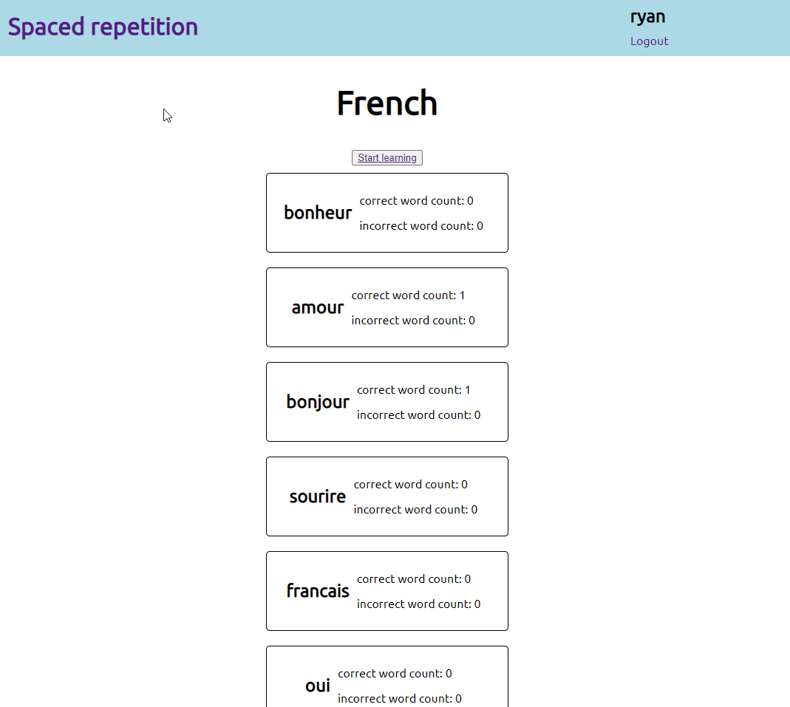
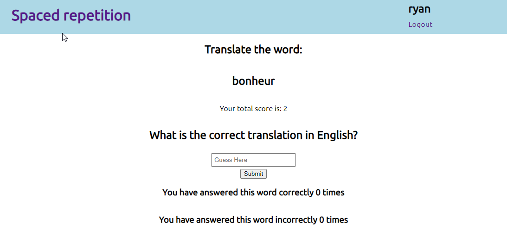
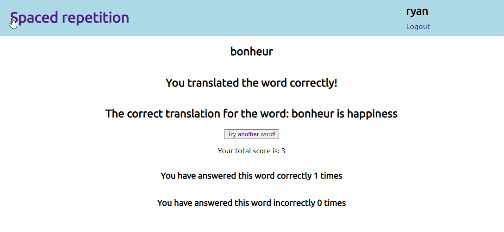

# Spaced repetition client

- [Live_App](https://spaced-repition-client.vercel.app/)
- [Server_Side_Repo](https://github.com/RShuken/spaced-repition-server)
- [Client_Side_Repo](https://github.com/RShuken/spaced-repition-client)

## Description

An app which uses spaced repetition to help people memorize a foreign language. The app display words in French and the user is  asked to input the corresponding word in a English.

## Screenshots

### Front-end technologies

Reactjs, HTML, CSS, JavaScript, HTML

### Back-end technologies

Node.js, Express

### Database

PostgreSQL

### Tested with

Cypress and Mocha

## Hosted on

Heroku and Vercel